# 📺 TV Image Receiver - Flutter & Android TV MQTT Communication

A real-time image sharing system that allows Flutter mobile apps to send images to Android TV using MQTT protocol. Perfect for displaying photos, presentations, or any visual content from your phone to your TV screen instantly.

## 🎯 What This Project Does

- **📱 Flutter Mobile App**: Capture, select, or upload images and send them to Android TV
- **📺 Android TV App**: Receives and displays images in real-time on your TV screen
- **🔄 MQTT Communication**: Uses lightweight MQTT protocol for real-time messaging
- **🔗 Pairing System**: Secure device pairing between mobile and TV
- **📸 Image Management**: Handles multiple images with indexing and control

## 🏗️ How It Works

```mermaid
graph LR
    A[📱 Flutter App] -->|MQTT| B[☁️ MQTT Broker]
    B -->|MQTT| C[📺 Android TV]
    
    A -->|1. Pair Request| B
    B -->|1. Pair Request| C
    C -->|2. Pair Response| B
    B -->|2. Pair Response| A
    A -->|3. Image URLs| B
    B -->|3. Image URLs| C
    C -->|4. Download & Display| C
```



### Communication Flow:
1. **Pairing**: Mobile app sends pair request to TV
2. **Authentication**: TV responds with confirmation
3. **Image Transfer**: Mobile sends image URLs via MQTT
4. **Display**: TV downloads and displays images
5. **Control**: Mobile can control which image to show

## 📁 Project Structure

```
tv-image-receiver/
├── flutter_app/          # 📱 Flutter mobile application
│   ├── lib/
│   ├── android/
│   ├── ios/
│   └── pubspec.yaml
├── android_tv/           # 📺 Android TV application
│   ├── app/
│   ├── build.gradle
│   └── settings.gradle
├── .env.example          # Environment variables template
└── README.md
```

## 🚀 Installation Guide

### Prerequisites

Before starting, ensure you have the following installed on your development machine:

- **Flutter SDK** (3.0.0 or higher) - [Install Flutter](https://docs.flutter.dev/get-started/install)
- **Android Studio** (or VS Code with Flutter extension)
- **Android SDK** (API level 21 or higher)
- **Java Development Kit** (JDK 8 or higher)
- **Git** - [Install Git](https://git-scm.com/downloads)
- **Android TV device** or **Android TV Emulator**

### Step 1: Clone the Repository

```bash
# Clone the project repository
git clone https://github.com/yourusername/tv-image-receiver.git

# Navigate to project directory
cd tv-image-receiver

# Check project structure
ls -la
```

### Step 2: 📱 Flutter Mobile App Installation

#### 2.1 Navigate to Flutter App Directory
```bash
cd flutter_app
```

#### 2.2 Install Flutter Dependencies
```bash
# Get all required packages
flutter pub get

# Verify Flutter installation
flutter doctor

# Check connected devices
flutter devices
```

#### 2.3 Create Configuration Files

Create the required configuration files (templates provided in Configuration section):

```bash
# Create .env file (copy from template below)
touch .env

# Create Firebase options (copy from template below)
mkdir -p lib
touch lib/firebase_options.dart
```

#### 2.4 Configure and Run Flutter App

```bash
# Run in debug mode on connected device
flutter run

# Or run in release mode
flutter run --release

# Or build APK for distribution
flutter build apk --release

# Install APK on specific device
flutter install
```

#### 2.5 Build for Different Platforms

```bash
# Build Android APK
flutter build apk --split-per-abi

# Build Android App Bundle (for Play Store)
flutter build appbundle

# Build for iOS (macOS only)
flutter build ios
```

### Step 3: 📺 Android TV App Installation

#### 3.1 Navigate to Android TV Directory
```bash
# Go back to root and enter Android TV project
cd ../android_tv
```

#### 3.2 Setup Android TV Project

```bash
# Check Gradle wrapper permissions
chmod +x gradlew

# Clean and build project
./gradlew clean
./gradlew build

# List available build variants
./gradlew tasks
```

#### 3.3 Connect Android TV Device

**Option A: Physical Android TV Device**
```bash
# Enable ADB debugging on TV (Settings > Device Preferences > About > Build 7 times)
# Enable Developer options > USB/Network debugging

# Connect via USB or find TV IP
adb connect YOUR_TV_IP:5555

# Verify connection
adb devices
```

**Option B: Android TV Emulator**
```bash
# Create Android TV emulator in Android Studio
# Tools > AVD Manager > Create Virtual Device > TV category
# Or use command line:
avdmanager create avd -n AndroidTV -k "system-images;android-30;google_apis;x86"
emulator -avd AndroidTV
```

#### 3.4 Build and Install Android TV App

```bash
# Install debug version directly to connected TV
./gradlew installDebug

# Or build release APK
./gradlew assembleRelease

# Install specific APK file
adb install app/build/outputs/apk/debug/app-debug.apk
```

#### 3.5 Using Android Studio (Alternative Method)

```bash
# Open Android Studio
studio .

# Or on macOS
open -a "Android Studio" .
```

1. **Open Project**: File → Open → Select `android_tv` folder
2. **Sync Project**: Click "Sync Now" when prompted
3. **Connect Device**: Ensure Android TV is connected via ADB
4. **Run App**: Click green "Run" button or press Shift+F10
5. **Select Target**: Choose your Android TV device from dropdown

### Step 4: 🔧 Project Configuration

#### 4.1 Configure MQTT Settings

Both apps need to use the same MQTT configuration. Update the settings in:

**Flutter App**: `.env` file
**Android TV**: `MainActivity.kt` topic variables

```bash
# Verify topics match between both apps
grep -r "pair_topic\|pairTopic" .
```

#### 4.2 Test Connection

```bash
# Start Android TV app first
adb shell am start -n com.example.tvimagereceiver/.MainActivity

# Then start Flutter app
cd ../flutter_app
flutter run
```

### Step 5: 🧪 Testing the Installation

#### 5.1 Verify Both Apps Are Running

```bash
# Check if Android TV app is running
adb shell dumpsys activity activities | grep tvimagereceiver

# Check Flutter app logs
flutter logs
```

#### 5.2 Test MQTT Communication

1. **Launch Android TV app** → Should show "MQTT Connection Active"
2. **Launch Flutter app** → Should show connection status
3. **Tap "Pair with TV"** in Flutter app
4. **Check Android TV** → Should show "Pair request received"
5. **Send test image** → Should appear on TV screen

#### 5.3 Debug Connection Issues

```bash
# Check ADB connection
adb devices

# Monitor Android TV logs
adb logcat | grep MQTT

# Monitor Flutter logs
flutter logs --verbose

# Check network connectivity
ping broker.hivemq.com
```

### Step 6: 📦 Building for Production

#### 6.1 Flutter Production Build

```bash
cd flutter_app

# Build optimized APK
flutter build apk --release --split-per-abi

# Build App Bundle for Play Store
flutter build appbundle --release

# Generated files location:
# build/app/outputs/flutter-apk/app-release.apk
# build/app/outputs/bundle/release/app-release.aab
```

#### 6.2 Android TV Production Build

```bash
cd android_tv

# Build release APK
./gradlew assembleRelease

# Sign APK (optional, for distribution)
./gradlew bundleRelease

# Generated files location:
# app/build/outputs/apk/release/app-release.apk
```

### Step 7: 🚀 Deployment

#### 7.1 Install on Multiple Devices

```bash
# Install Flutter app on multiple phones
adb devices
adb -s DEVICE_ID install build/app/outputs/flutter-apk/app-release.apk

# Install TV app on multiple Android TVs
adb connect TV_IP:5555
adb install android_tv/app/build/outputs/apk/release/app-release.apk
```

#### 7.2 Distribution Options

- **Google Play Store** (for mobile app)
- **Android TV Play Store** (for TV app)
- **APK Direct Distribution** (enterprise/testing)
- **Firebase App Distribution** (beta testing)

## ⚙️ Configuration

### 🔧 Environment Variables (.env)

Create a `.env` file in the `flutter_app/` directory:

```env
# MQTT Broker Configuration
MQTT_BROKER=your-mqtt-broker.com
MQTT_HOST=your-mqtt-broker.com
MQTT_PORT=1883

# Topic Configuration  
MQTT_TOPIC_PREFIX=tv/
TV_SERIAL=androidtv_001

# Authentication (optional)
MQTT_USERNAME=
MQTT_PASSWORD=

# Image Upload API
IMAGE_UPLOAD_API_URL=https://your-api.com/upload
IMAGE_UPLOAD_API_KEY=your-api-key-here

# Firebase Configuration
FIREBASE_PROJECT_ID=your-project-id
FIREBASE_API_KEY=your-api-key
```

### 🔥 Firebase Configuration (firebase_options.dart)

Create `flutter_app/lib/firebase_options.dart`:

```dart
// File generated by FlutterFire CLI.
// ignore_for_file: lines_longer_than_80_chars, avoid_classes_with_only_static_members
import 'package:firebase_core/firebase_core.dart' show FirebaseOptions;
import 'package:flutter/foundation.dart'
    show defaultTargetPlatform, kIsWeb, TargetPlatform;

class DefaultFirebaseOptions {
  static FirebaseOptions get currentPlatform {
    if (kIsWeb) {
      return web;
    }
    switch (defaultTargetPlatform) {
      case TargetPlatform.android:
        return android;
      case TargetPlatform.iOS:
        return ios;
      case TargetPlatform.macOS:
        throw UnsupportedError(
          'DefaultFirebaseOptions have not been configured for macos - '
          'you can reconfigure this by running the FlutterFire CLI again.',
        );
      case TargetPlatform.windows:
        throw UnsupportedError(
          'DefaultFirebaseOptions have not been configured for windows - '
          'you can reconfigure this by running the FlutterFire CLI again.',
        );
      case TargetPlatform.linux:
        throw UnsupportedError(
          'DefaultFirebaseOptions have not been configured for linux - '
          'you can reconfigure this by running the FlutterFire CLI again.',
        );
      default:
        throw UnsupportedError(
          'DefaultFirebaseOptions are not supported for this platform.',
        );
    }
  }

  static const FirebaseOptions web = FirebaseOptions(
    apiKey: 'your-web-api-key',
    appId: 'your-web-app-id',
    messagingSenderId: 'your-sender-id',
    projectId: 'your-project-id',
    authDomain: 'your-project.firebaseapp.com',
    storageBucket: 'your-project.appspot.com',
  );

  static const FirebaseOptions android = FirebaseOptions(
    apiKey: 'your-android-api-key',
    appId: 'your-android-app-id',
    messagingSenderId: 'your-sender-id',
    projectId: 'your-project-id',
    storageBucket: 'your-project.appspot.com',
  );

  static const FirebaseOptions ios = FirebaseOptions(
    apiKey: 'your-ios-api-key',
    appId: 'your-ios-app-id',
    messagingSenderId: 'your-sender-id',
    projectId: 'your-project-id',
    storageBucket: 'your-project.appspot.com',
    iosClientId: 'your-ios-client-id',
    iosBundleId: 'com.yourcompany.yourapp',
  );
}
```

> **📝 Note**: To generate this file automatically, use FlutterFire CLI:
> ```bash
> dart pub global activate flutterfire_cli
> flutterfire configure
> ```

## 🔌 MQTT Topics Structure

The application uses the following MQTT topic structure:

```
{MQTT_TOPIC_PREFIX}{TV_SERIAL}/
├── pair                 # Pairing requests
├── pair_response        # Pairing confirmations  
├── images              # Image URL lists
└── image               # Image display control
```

**Example Topics:**
- `tv/androidtv_001/pair`
- `tv/androidtv_001/pair_response`
- `tv/androidtv_001/images`
- `tv/androidtv_001/image`

## 📱 Usage

### Mobile App
1. **Launch** the Flutter app on your phone
2. **Connect** to MQTT broker automatically
3. **Pair** with Android TV by tapping "Pair with TV"
4. **Select/Capture** images to send
5. **Send** images to TV
6. **Control** image display remotely

### Android TV App
1. **Install** and launch the TV app
2. **Wait** for pairing request from mobile
3. **Confirm** pairing when prompted
4. **View** images as they arrive
5. **Navigate** through images via mobile control

## 🛠️ Development

### Flutter App Features
- 📸 Image capture and selection
- ☁️ Cloud image upload
- 🔄 Real-time MQTT communication
- 📱 Responsive mobile UI
- 🔗 Device pairing system

### Android TV Features
- 📺 TV-optimized interface
- 🖼️ Full-screen image display
- 📥 Automatic image downloading
- 💾 Local image caching
- 🎮 Remote control support

## 🐛 Troubleshooting

### Common Issues

**MQTT Connection Failed**
- Verify broker URL and port in `.env`
- Check network connectivity
- Ensure firewall allows MQTT traffic

**Pairing Not Working**
- Confirm both devices use same topic structure
- Check MQTT broker logs
- Verify TV_SERIAL matches in both apps

**Images Not Displaying**
- Ensure image URLs are accessible
- Check Android TV internet connection
- Verify storage permissions

**Firebase Errors**
- Run `flutterfire configure` to regenerate config
- Check Firebase project settings
- Verify API keys and project ID

## 📋 Requirements

### Flutter App
- Flutter 3.0.0+
- Dart 2.17.0+
- Android 6.0+ / iOS 12.0+

### Android TV App
- Android API 21+ (Android 5.0)
- Android TV / Google TV
- Network connectivity

## 🤝 Contributing

1. Fork the repository
2. Create feature branch (`git checkout -b feature/amazing-feature`)
3. Commit changes (`git commit -m 'Add amazing feature'`)
4. Push to branch (`git push origin feature/amazing-feature`)
5. Open Pull Request

## 📄 License

This project is licensed under the MIT License - see the [LICENSE](LICENSE) file for details.

## 🙏 Acknowledgments

- **MQTT.org** for the messaging protocol
- **HiveMQ** for free MQTT broker
- **Flutter Team** for the amazing framework
- **Firebase** for backend services

---

**Made with ❤️ for seamless mobile-to-TV communication**
